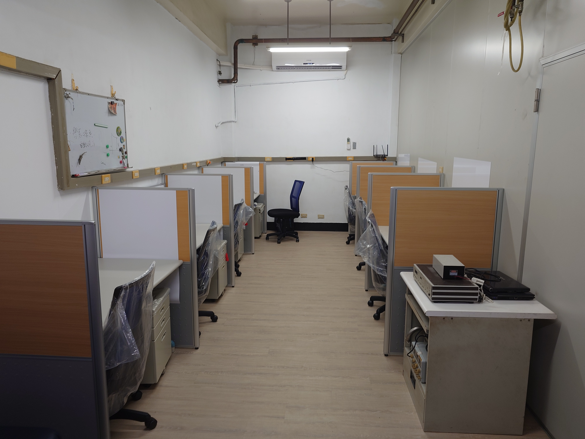
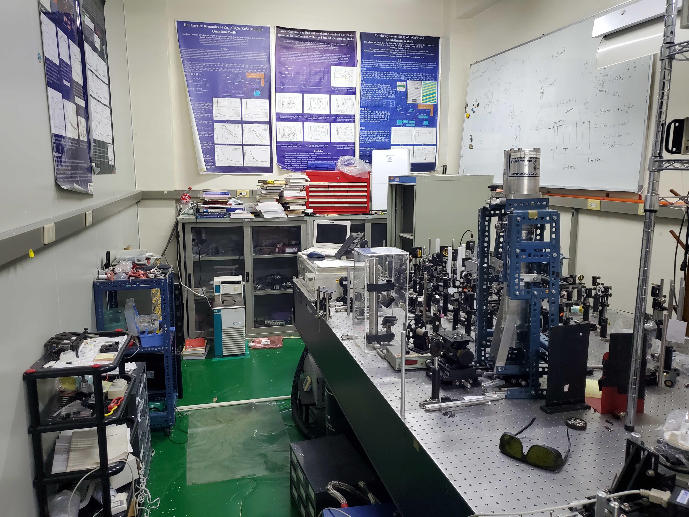
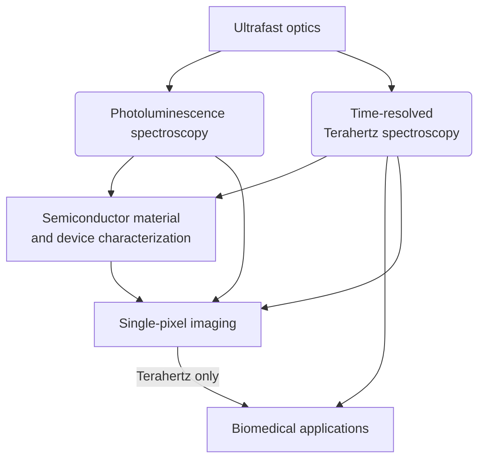

<div2>
<!---There is an available MSc position under the Rayko Research group. -->
I have ran out of funding, so unless you can self-fund then I can't offer you a master position :/
<!--more-->


I am hiring Master's students to work in my laboratory. As I have just refurbished the laboratory from the previous professor, you will be getting a brand new workspace. I also inherited an optical laboratory and you will be working with it.
|     |     | 
|:---:|:---:|
|  |  |

### Salary
MSc students will be paid **10,000NTD per month** as a minimum (but not funding now). However, getting good results will increase your salary 
- Acceptance of first author publications will increase your monthly salary by 500NTD, or more for high quality journals.
- Actively improving your English will also be rewarded. 
- Contributions to publications of other NSYSU professors will also be rewarded (between 100-300NTD). 
- The NSYSU Physics department pays additional salary for marking undergraduate homeworks (as a teaching assistant) with salary depending on number of homeworks marked.

### Research area
You will be working with ultra-fast (100 femtosecond) optical equipment. This will involve setting up optical experiments then analysing the results, thus you will gain a lot of experience programming optical equipment and aligning optics. The data analysis will be done either in Matlab, Julia or Python (no prior experience is required).
 

<strong>Potential Research choices</strong>

  

</div2>
