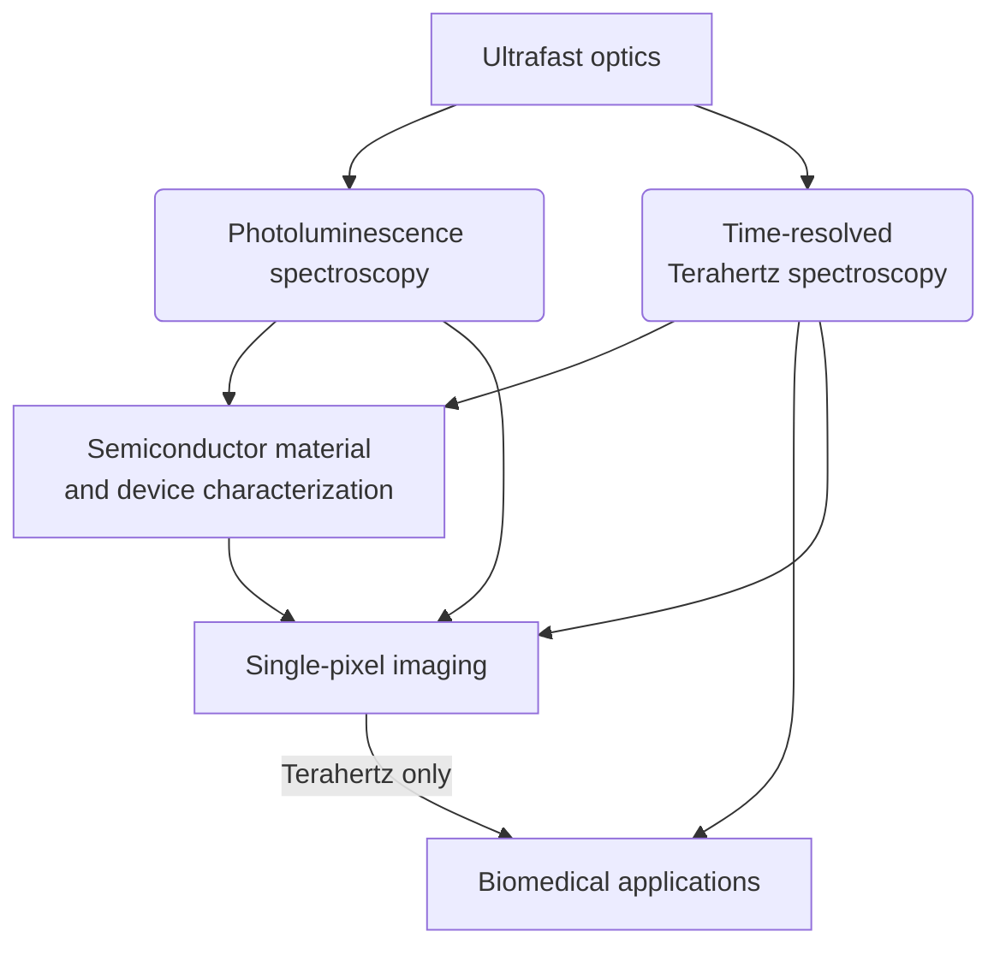

<div2>
There is an available PhD position under the Rayko Research group. 
<!--more-->


I am hiring PhD students to work in my laboratory. As I have just refurbished the laboratory from the previous professor, you will be getting a brand new workspace. I also inherited an optical laboratory and you will be working with it. 
<table class="table2">
<tr>
  <td> </td>
  <td> </td>
</tr>

</table>

### Salary
PhD students will be paid **15,000NTD per month** as a minimum. However, getting good results will increase your salary 
- Acceptance of first author publications will increase your monthly salary by 500NTD, or more for high quality journals.
- Actively improving your English will also be rewarded. 
- Contributions to publications of other NSYSU professors will also be rewarded (between 100-300NTD). 
- The NSYSU Physics department pays additional salary for marking undergraduate homeworks (as a teaching assistant) with salary depending on number of homeworks marked.
<!--- For additional salary, you can apply for the [*International Elite Doctoral Student Entrance Scholarship*](https://phys.nsysu.edu.tw/p/406-1181-286093,r111.php?Lang=en) provided by the Office of Academic Affairs, NSYSU. See chapter III of this [PDF](https://oia.nsysu.edu.tw/static/file/308/1308/img/3665/688144043.pdf). -->

### Research area
You will be working with ultra-fast (100 femtosecond) optical equipment. This will involve setting up optical experiments then analysing the results, thus you will gain a lot of experience programming optical equipment and aligning optics. The data analysis will be done either in Matlab, Julia or Python (no prior experience is required).
 

<strong>Potential Research choices</strong>

  

### Potential overseas exchange to the University of Warwick, UK.

There is a potential overseas exchange to the University of Warwick. The duration of PhD student's trip to the UK will be from 3 months up to 1 year abroad.

This is because I have an honorary researcher position at the [University of Warwick](https://warwick.ac.uk/fac/sci/physics/research/condensedmatt/ultrafastphotonics/group/rayko/ "Rayko at the Warwick Ultrafast photonics group") so I have a connection there. In particular, it is with my previous postdoc supervisor [Emma Pickwell-MacPherson](https://warwick.ac.uk/fac/sci/physics/research/condensedmatt/ultrafastphotonics/group/emma/ "Emma Pickwell-MacPherson"). She is currently undertaking a work under a grant called 
[Terabotics](https://warwick.ac.uk/fac/sci/physics/research/condensedmatt/ultrafastphotonics/emmasthzgroup/terabotics/ "Terabotics Programme Grant, Emma Pickwell-MacPherson"), and it focuses on developing Terehertz techonology for *in vivo early detection and improved treatment of cancer*. 

To have any chance of being approved by Emma, **the candidate must choose a research path that will be useful to her**. In other words, the student will need to learn the fundamentals of Terahertz time-domain spectroscopy and be familar with extracting the optical properties from Terahertz time-domain data. Further, being familiar with the biomedical aspect of in-vivo terahertz imaging of skin will also help, but it is not essential.

</div2>
