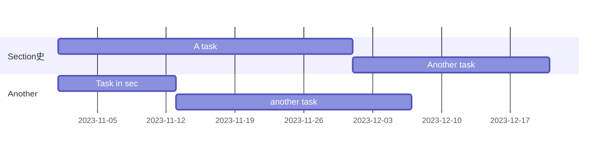

The website is underconstruction, so there is no project here yet. But check out the slides below


```mermaid
gantt
  dateFormat  YYYY-MM-DD
  section Section史
  A task           :a1, 2023-11-01, 30d
  Another task     :after a1  , 20d
  section Another
  Task in sec      :2023-11-01  , 12d
  another task      : 24d
```