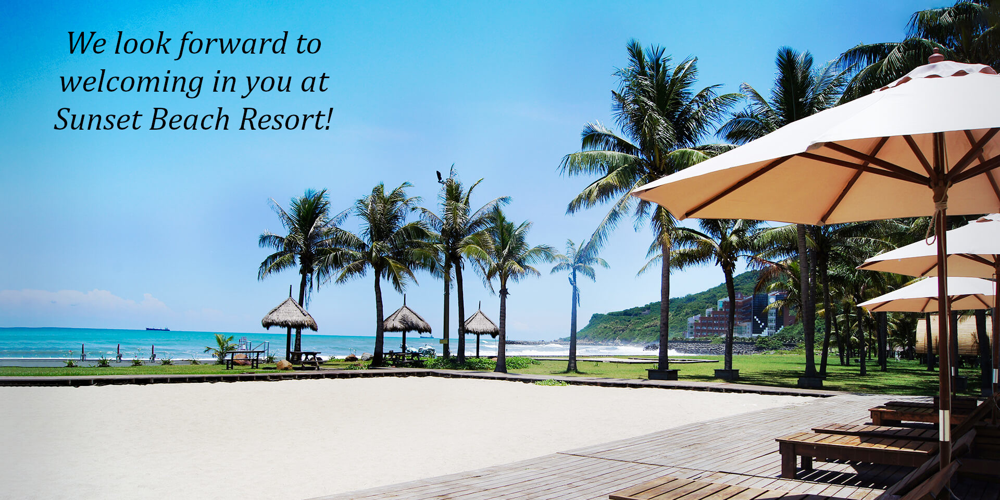



Welcome to the webpage showing the information about the *Taiwan THz conference 2024* in NSYSU, Tues-18/June. 
 **To register**, contact Rayko Stantchev at rayko.stantchev[at]g-mail.nsysu.edu.tw.

# Talk schedule
**Date: Tuesday 18/June/2024**

| Time  | Speaker  | Talk Title |
|:---------:|:---------:|:---------:|
| 11:00-11:10 | [Rayko I. Stantchev](/author/rayko-ivanov-stantchev) | Opening Remarks | 
| 11:10-11:30 | Javed Iqbal | Investigation and fabrication of high-K and low-loss structural nanocomposites for THz wave | 
| 11:30-11:50 | [Hsin-Yu Yao](https://physics.ccu.edu.tw/p/404-1077-33740.php?Lang=zh-tw) | Ultra-sensitive refractive index sensing based on a tri-mode accidental-boundstate in continuum of an ultra-thin high-contrast dielectric grating | 
| 11:50-12:10 | Prabir Garu | Design of SIW-fed endfire exponential tapered horn antenna for sub-THz communications | 
| **12:10-12:50** | **Lunch** | **40 Mins lunch break** | 
| 12:50-13:10 | Pouya Torkaman | Harmonizing Nonlinearity in Channel: Forging a Path to Robust THz Communication Systems | 
| 13:10-13:30 | [Chan-Shan Yang](https://scholar.lib.ntnu.edu.tw/zh/persons/chan-shan-yang) | Terahertz Mie resonance and magnetoplasmonic effect by chain formation in ferrofluid | 
| 13:30-13:50 | [Chien-Ming Tu](https://ep.nycu.edu.tw/en/faculty_info/%e6%9d%9c%e5%bb%ba%e6%98%8e/) | Terahertz emission spectroscopy of topological material candidate SrCd2Sb2 single crystals | 
| **13:50-14:10** | **Tea & Coffee** | **20 mins break** | 
| 14:10-14:30 | [Hui-Hsin Hsiao](https://scholars.lib.ntu.edu.tw/cris/rp/rp200463) | Selective multi-wavelength and narrowband infrared thermal emitters | 
| 14:30-14:50 | Seyed Mostafa Latifi | High refractive index photocurable ceramic resin for THz applications | 
| 14:50-15:10 | [Yu-Hsiang Cheng](https://homepage.ntu.edu.tw/~yuhsiang/pi.html) | THz filters and couplers fabricated by laser machining and photolithography | 
| **15:10-15:30** | **Tea & Coffee** | **20 mins break** | 
| 15:30-15:50 | Chia-Ming Mai | Hyperspectral Terahertz Computational Imaging and Its Applications | 
| 15:50-16:10 | [Rayko I. Stantchev](/author/rayko-ivanov-stantchev) | Analytical expression for enhanced focusing of short focal-length spherical THz lenses | 
| 16:10-16:20 | [Rayko I. Stantchev](/author/rayko-ivanov-stantchev) | Closing Remarks | 
| **16:20-16:40** | **Tea & Coffee** | **20 mins break** | 
| 16:40-17:10 | Laboratory Tour | Optional Laboratory Tour | 

All talks are 16 minutes long with 3 minutes of questions (and 1 min for change over).
This is current talk schedule of confirmed talks as of 07/June, it might change.

# Venue location

VIP room, Sizihwan Sunset Beach Resort,  
No. 51號, Lianhai Rd, Gushan District,  
Kaohsiung City, 804  

Google maps link: [https://maps.app.goo.gl/JddumxrPcsUvvYMBA](https://maps.app.goo.gl/JddumxrPcsUvvYMBA)

<iframe class="map" src="https://www.google.com/maps/embed?pb=!1m18!1m12!1m3!1d3682.7751381598337!2d120.26219631095239!3d22.624870630966807!2m3!1f0!2f0!3f0!3m2!1i1024!2i768!4f13.1!3m3!1m2!1s0x346e0408391921ab%3A0xa2079f8580985bf2!2sSunset%20Beach%20Resort!5e0!3m2!1sen!2stw!4v1714029123518!5m2!1sen!2stw" width="100%" height="450px" style="border:0;" loading="lazy" referrerpolicy="no-referrer-when-downgrade"></iframe>

<table class="table2">
<tr>
  <td> </td>
  <td> </td>
</tr>

</table>

Pictures courtesy of Sizihwan Sunset Beach Resort, [https://www.seasbay.com.tw/](https://www.seasbay.com.tw/).

## Reimbursement

Contact [Rayko I. Stantchev](/author/rayko-ivanov-stantchev) via e-mail rayko.stantchev[at]g-mail.nsysu.edu.tw if he has not sent you information about the travel reimbursement.