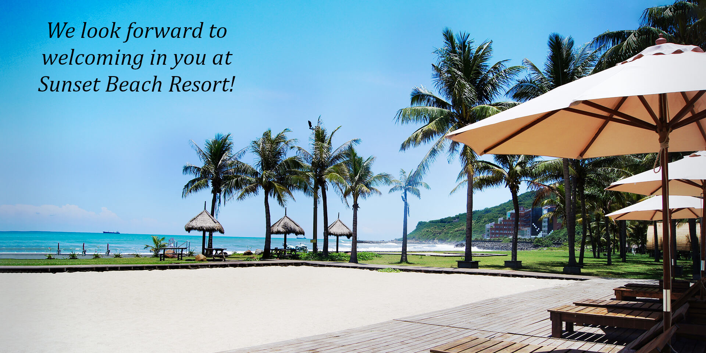



Welcome to the webpage showing the information about the *Taiwan THz winter workshop 2025* in NSYSU, Mon-13/January/2025. 
 **To register**, contact Rayko Stantchev at rayko.stantchev[at]g-mail.nsysu.edu.tw.

[The Annual Physics Conference](https://tps2025.conf.tw/site/page.aspx?pid=901&sid=1600&lang=en) by the Taiwan Physics Society will be held in the same university from Tue-14 until Thu-16 January. The idea is to have small THz satellite meeting along side Taiwan's biggest physics conference. 

# Talk schedule
**Date: Monday 13/January/2025**

| Time  | Speaker  | Talk Title |
|:---------:|:---------:|:---------:|
| 10:00-10:10 | [Rayko I. Stantchev](/author/rayko-ivanov-stantchev) | Opening Remarks | 
| 10:10-10:30 | [ Elmer Estacio ](https://nip.upd.edu.ph/profiles/elmer-s-estacio/) |  To be announced  | 
| 10:30-10:50 | [ Hsin-Yu Yao ](https://physics.ccu.edu.tw/p/404-1077-33740.php?Lang=zh-tw) | Intrinsic Resonance in Gyrotrons Using Non-Resonant RF Structures | 
| 10:50-11:10 | [ Chih-Wei Luo ](https://udllab.web.nycu.edu.tw/professor/) | Generation and manipulation of circularly polarized THz dual pulses | 
| **11:10-11:30** | **Tea & Coffee** | **20 mins break** | 
| 11:30-11:50 | [ Chan-Shan Yang ](https://sites.google.com/view/units-lab/Home?authuser=0) |  To be announced  | 
| 11:50-12:10 | [ Masafumi Fukunari ](https://r-info.ad.u-fukui.ac.jp/Profiles/30/0002988/profile.html?lang=en) |  To be announced  | 
| **12:10-12:50** | **Lunch** | **40 Mins lunch break** | 
| 12:50-13:10 | [ Yu-Chieh Wen ](https://www.phys.sinica.edu.tw/~optical/index_e.php?p=groupLeader_e) | Origin of Nonlinear Photocurrents in Chiral Multifold Semimetals Unveiled by Terahertz Emission Spectroscopy | 
| 13:10-13:30 | [ Yuya Ishikawa ](https://r-info.ad.u-fukui.ac.jp/Profiles/30/0002976/profile.html?lang=en) |  To be announced  | 
| 13:30-13:50 | [ Hideaki Kitahara ](https://r-info.ad.u-fukui.ac.jp/Profiles/30/0002981/profile.html?lang=en) |  To be announced  | 
| **13:50-14:10** | **Tea & Coffee** | **20 mins break** | 
| 14:10-14:30 | [ Chien-Ming Tu ](https://ep.nycu.edu.tw/en/faculty_info/%E6%9D%9C%E5%BB%BA%E6%98%8E/) | Chemical pressure-induced topological order in SrCd2(As1-xSbx)2: A terahertz emission study | 
| 14:30-14:50 | [ Eunmi Choi ](https://emchoi.unist.ac.kr/?page_id=8) |  To be announced  | 
| 14:50-15:10 | [ Chiko Otani ](https://www.riken.jp/en/research/labs/rap/thz_sens_imag/index.html) |  To be announced  | 
| **15:10-15:30** | **Tea & Coffee** | **20 mins break** | 
| 15:30-15:50 |  Empty  |   | 
| 15:50-16:10 | [Rayko I. Stantchev](/author/rayko-ivanov-stantchev) | To be announced | 
| 16:10-16:30 |  Empty  |   | 
| 16:30-16:40 | [Rayko I. Stantchev](/author/rayko-ivanov-stantchev) | Closing Remarks and Group photo | 
| **16:40-17:00** | **Tea & Coffee** | **20 mins break** | 
| 17:00-17:35 | Laboratory Tour | Optional Laboratory Tour | 

All talks are 16 minutes long with 3 minutes of questions (and 1 min for change over).
This is current talk schedule of confirmed talks as of 23/Oct/2025, it will change!

# Venue location

VIP room, Sizihwan Sunset Beach Resort,  
No. 51號, Lianhai Rd, Gushan District,  
Kaohsiung City, 804  

Google maps link: [https://maps.app.goo.gl/JddumxrPcsUvvYMBA](https://maps.app.goo.gl/JddumxrPcsUvvYMBA)

<iframe class="map" src="https://www.google.com/maps/embed?pb=!1m18!1m12!1m3!1d3682.7751381598337!2d120.26219631095239!3d22.624870630966807!2m3!1f0!2f0!3f0!3m2!1i1024!2i768!4f13.1!3m3!1m2!1s0x346e0408391921ab%3A0xa2079f8580985bf2!2sSunset%20Beach%20Resort!5e0!3m2!1sen!2stw!4v1714029123518!5m2!1sen!2stw" width="100%" height="450px" style="border:0;" loading="lazy" referrerpolicy="no-referrer-when-downgrade"></iframe>

<table class="table2">
<tr>
  <td> </td>
  <td> </td>
</tr>

</table>

Pictures courtesy of Sizihwan Sunset Beach Resort, [https://www.seasbay.com.tw/](https://www.seasbay.com.tw/).

## Reimbursement and fees

Only overseas speakers will be given a speaker fee of 10,000NTD. Contact [Rayko I. Stantchev](/author/rayko-ivanov-stantchev) via e-mail rayko.stantchev[at]g-mail.nsysu.edu.tw if he has not sent you information about receiving this speaker fee.

Otherwise, there is no registration fee.